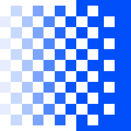
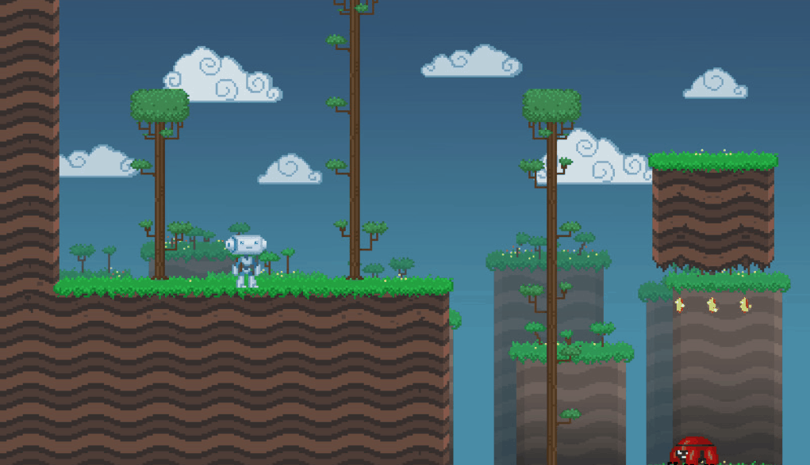
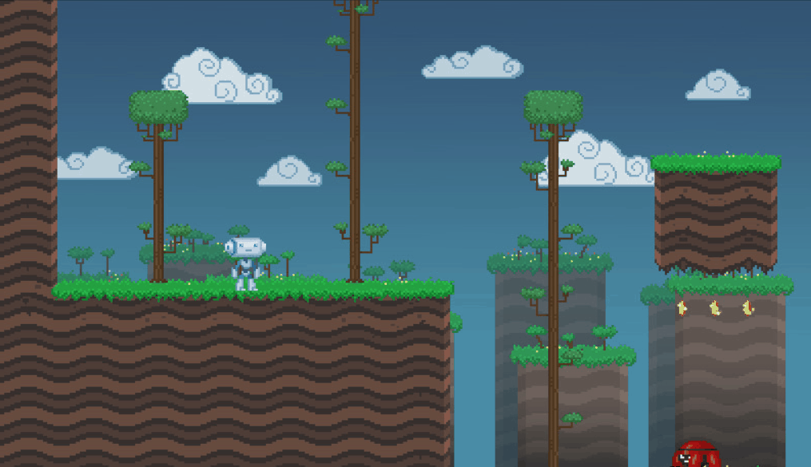
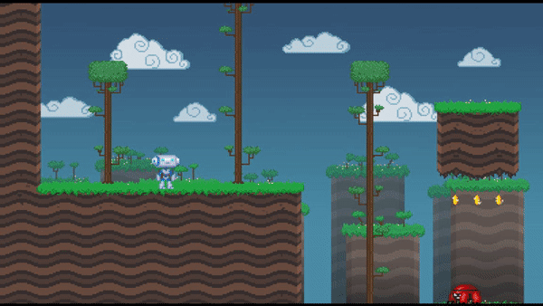
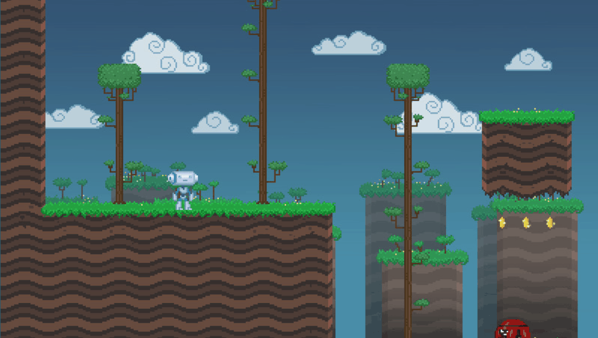
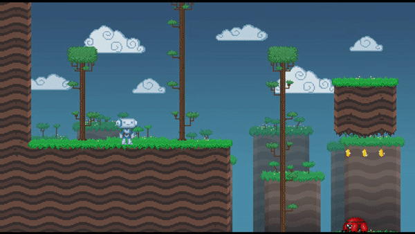

#  Godot Universal Fade

Universal Fade does 2 things:
- fades out
- fades in

That's it. You can use it however you need and easily so. To fade out, you do:
```GDScript
Fade.fade_out()
```
And your screen will fade out to black using simple fade effect in 1 second. All magic like instancing effect nodes etc. happens automatically, you just call one method. The effect appears at CanvasLayer 100 and covers entire screen (adjusting automatically to its size).

When your screen is faded out, you can do:
```GDScript
Fade.fade_in()
```
And it will return to normal.

Note that, while fade can be called anywhere at any time, it will fail if you call it right at the project launch (e.g. in `_ready()` method of your main scene). If you want to fade that early for whatever reason, wait a single frame.

## How to scene transition

Fading out and in is cool and all, but you probably want to use it for something other than itself. The most common usage is scene transiton. You can use this piece of code:
```GDSCript
await Fade.fade_out().finished
get_tree().change_scene(new_scene)
Fade.fade_in()
```
`fade_out()` and `fade_in()` will return instance of Fade node. It emits `finished` signal when the effect ends. In case of fade in, the node is automatically freed at the end. In case of fade out, the node stays. You need to remove it yourself (using the reference you obtained) or do a fade in, which will remove it automatically.

You can pause the game while fading. The Fade node will process normally during pause.

## Additional stuff

Fade methods come with a few parameters. They are:

- `time` - time of the effect in seconds. By default it's 1
- `color` - color to fade to. By default it's black
- `pattern` - pattern used for the effect. See "Patterns" section. If empty string is passed (default), there will be no pattern. The patterns are located in `addons/UniversalFade/Patterns` folder. For argument, your provide the base name of the pattern file, e.g. "Diamond" to use "Diamond.png"
- `reverse` - if true, pattern will be reversed. Defaults to false for fade out and true for fade in
- `smooth` - if true, the pattern will have smoothed alpha. Defaults to false

Example call with all arguments:

```GDScript
Fade.fade_out(1, Color.BLUE, "Diamond", false, false)
```

All arguments are optional. If you want to use a different patterns directory, modify the `addons/UniversalFade/patterns_directory` project setting.

## Patterns

Probably the most cool thing about this node. You can use patterns to spice up your fading effect. Here's example pattern:


Pattern is a gradient of colors ranging from white to black. The node uses a shader effect that fades the colors gradually. When fading out, white color will disappear first. When fading in, black color will disappear first. When you use the `reverse` argument, the order will be reversed. You can achieve the best effect when fade in and fade out use different `reverse`.

The smooth will smoothen your alpha, i.e. the colors will fade gradually instead of being sharp. Here's a comparison between smoothed and non-smoothed fade (same pattern):



## Crossfade

A special type of fade that does both fade in and fade out, interweaving "before" and "after" screens. Example crossfade:



You can achieve this effect by using `crossfade_prepare()` and `crossfade_execute()` functions. The former will take "snapshot" of the current screen. It will be frozen until the effect is finished. The second will do the actual crossfade. The idea is that you change the screens (e.g. change scene, make something appear) between these methods.

Example code for changing scene with a crossfade:
```GDScript
Fade.crossfade_prepare()
get_tree().change_scene(new_scene)
Fade.crossfade_execute()
```

`crossfade_prepare()` takes the same parameters as other fade methods, except color. `crossfade_execute()` takes no parameters, because the prepare method does all the setup. Example call with all arguments:

```GDScript
Fade.crossfade_prepare(1, "Diamond", false, false)
```

Note that crossfade looks better without smoothing.

## Included patterns

Universal Fade comes with several built-in patterns. Unfortunately I'm not good in making them, so half of them are just simple gradients. The Diamond pattern is kinda borrowed from RPG Maker, please don't tell anyone, thx.

You can easily add custom patterns to the UniversalFade directory. The included patterns are all `1920x1080` in size. The pattern will fit to screen anyways, but you might want to match the proportions, so they don't appear distorted. btw if you made a cool fade pattern and want to contribute it here, open an issue and attach the image. You will be credited if it gets included :)

### List of patterns

(I only include either smoothed or non-smoothed preview)

- Diagonal (smoothed)


- Diamond (not smoothed)


- GradientHorizontal (smoothed)


- GradientVertical (smoothed)



- Noise (not smoothed)


- Swirl (not smoothed)


- Radial (smoothed) - Credit to [@maktoobbgar](https://github.com/maktoobgar)



### Additional patterns

Some websites where you can find more patterns:

- [Scene Manager Shader Patterns](https://github.com/maktoobgar/scene_manager/tree/main/addons/scene_manager/shader_patterns) - A similar Godot addon that has a different set of patterns.
- [mgshellc](https://mgshellc.com/tkxpmaterials/transition.html) - Lots of transition patterns for RPG Maker XP.
- [GDUnlimited](https://www.gdunlimited.net/resources/cat/rpg-maker-vx-ace/transitions) - Some more RPG Maker patterns.

The addon supports transition effects from RPG Maker XP and any other programs that use grayscale transition effects, so it's easy to find more various effects.

___
You can find all my addons on my [profile page](https://github.com/KoBeWi).

<a href='https://ko-fi.com/W7W7AD4W4' target='_blank'></a>
